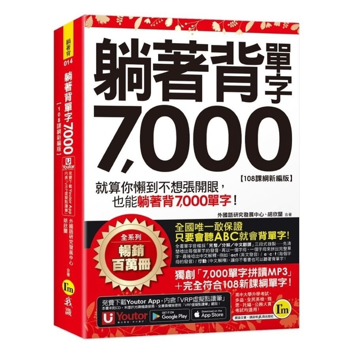

## "躺著背單字 7,000"：
<!--  -->

    

* Some of the translations are different from Cambridge, which is confusing.

Total 6 Levels, originally 2 pages a day, but found the speed is too slow, on 2023/12/19 started to try 4-6 pages a day.