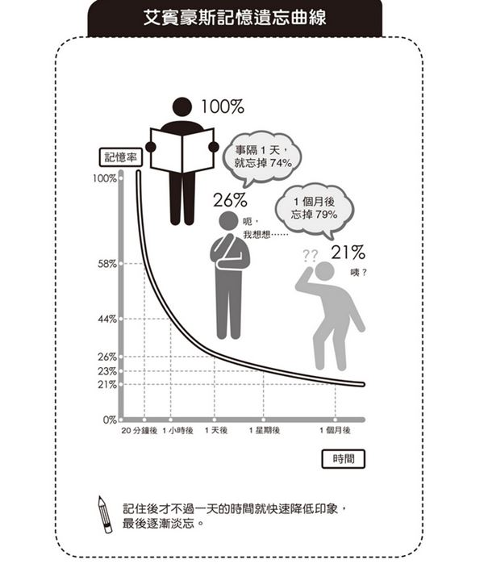
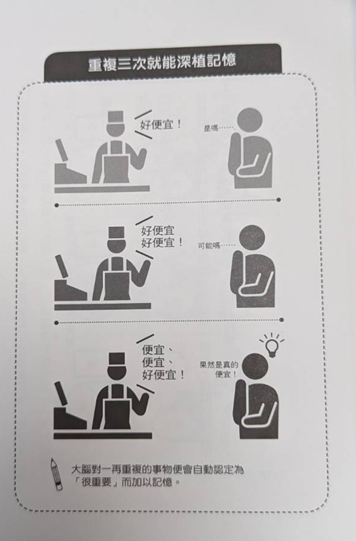

# 下定決心，就能做到
打從心裡認為「重要的」、「珍貴的」資訊就不容易忘記

* 打從心底相信大學考試很重要，只要考上了就前途似錦的人，對於讀書的記憶力自然會變強
* 打從心底認為人生並非只有考試，除了考試還是有很多厲害的人功成名就，這樣大腦就會判定讀書不一定很重要

不愉快的記憶會被判定為不要重的資訊

因此你必須打從心底相信此時此刻你想要嘗試的事情或目標，像是此時此刻想要嘗試的學習方法

# 大腦就是善忘
艾賓豪斯記憶遺忘曲線

我們必須以人類是善忘的動物為前提，從記住自己想要記住的事物作為起跑點

# 掌握複習的最佳時機
1. 時機... 何時複習
2. 次數... 複習幾遍

從艾賓豪斯記憶遺忘曲線中的結論來說，複習的最佳時機是在 「還記住一半的時候」

在還記住 80%、90% 的時候複習，根本只是浪費時間；但如果已經忘了一半以上，又需要從頭理解，就又有點遲了

### 記住一半又忘記一半的時候，大概會是學習後的 20~60 分鐘左右

20 分鐘一次的複習頻率大概就是廣告的頻率！

類似「一家烤肉萬家香」、「京都念慈菴」這種 N 年前的廣告現在都還記得，難道不是很厲害的記憶力嗎？

# 3 次和 9 次是一天中最佳複習次數
三人成虎
因為很重要，所以要說三次！
實驗證明，大腦對於說三次以上的話信以為真

大腦會將一再出現的事情判定為重要，不太重要的事情就不會重複

如果有一件非做不可，要超級提升記憶力，那就是一天 9 次
### 一回三次，一天三回

因此，
1. 以 20 分鐘 (至一小時)，一次的區間加以複習
2. 一天複習 3 次或 9 次
