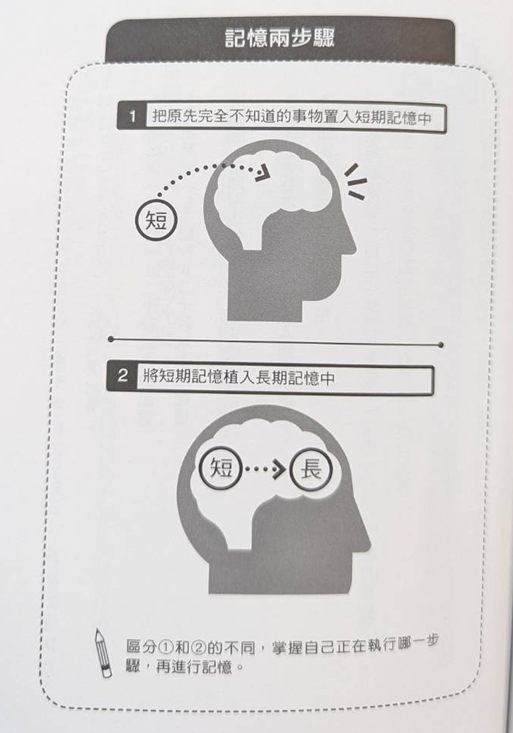
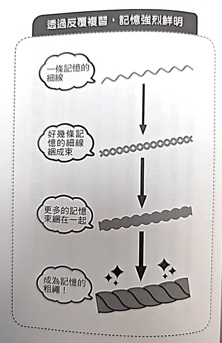
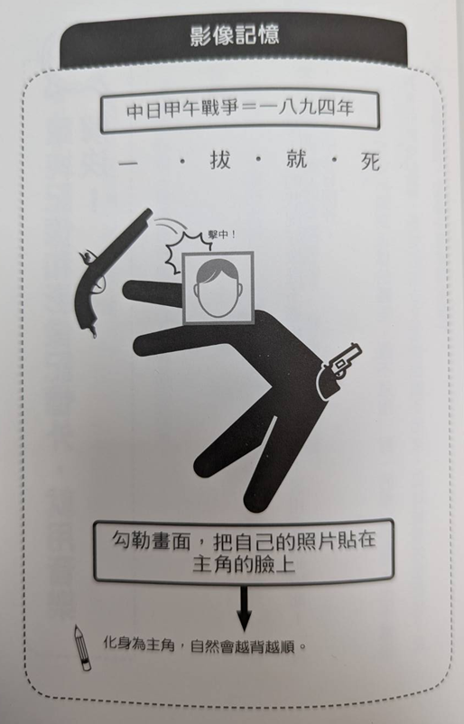
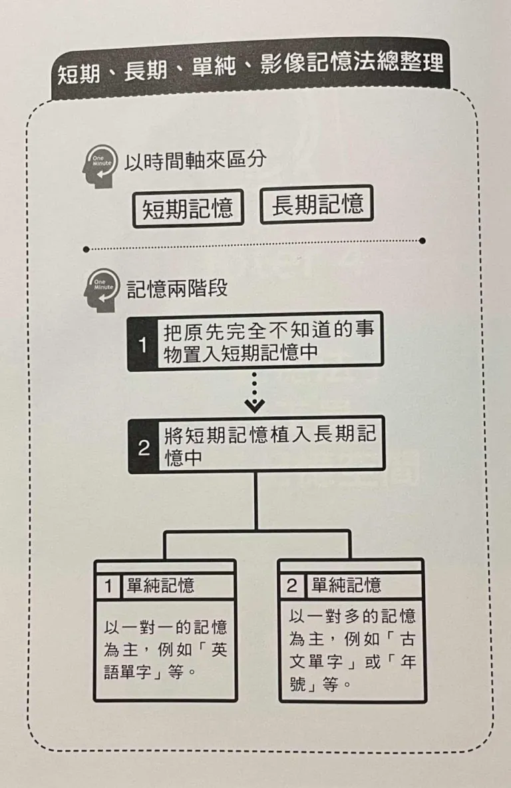

# 區分記憶類型，讓背誦成為拿手強項

### 記憶分成 4 中類型

### 短期記憶限時 20 秒
20 秒以內的記憶就屬於短期記憶，一次大概可以寄住 5~9 位數，然後過 20 秒之後就會忘記
反之，超過 20 秒就是長期記憶，那怕只有 30 秒，也算是長期記憶

* STM (Short Term Memory) 短期記憶：20 秒內
* LTM (Long Term Memory) 長期記憶：20 秒以上的記憶

# 長期記憶區分為單純記憶與影像記憶

* 單純記憶又稱為 「單純反覆記憶」；特性是「有什麼就記什麼」，所以也稱「意義記憶」

對於將自己所理解的語意記下來，就屬於單純記憶，像是雞、貓、狗都是生活中一在出現的字眼，自然而然就記住了

但困難的字，還是會隨著記憶遺忘曲線漸漸遺忘

### 伴隨影像有助於進入長期記憶
* 影像記憶又稱為「插曲 (episode) 記憶」，意思是「隨著某一段插曲一同記住的記憶」

舉例來說：
1. 全家人一起去看煙火
2. 和喜歡的人一起去看煙火

即使是未曾體驗過的，只要有影像浮現就可以了

例如，為了記住成語「喧賓奪主」，而用「乞丐趕廟公」來幫助記憶，廟公原本是廟的主人，居然被莫名其妙來的乞丐趕走，這樣有個明確意象的畫面，就容易深植到長期記憶

# 單純記憶和影像記憶各有擅長的領域

因此分類很重要
「語言、本國史、世界史」 適用單純記憶
單純記憶適用「一對一」的記憶
利用一問一答的方式，就適合單純記憶；
中華民國是誰建國的？ 孫中山。
screen 是什麼意思？ 螢幕。

單純記憶要搭配 一秒一個英文單字的方式 記憶

# 千萬別用諧音背單字

以 「mouse = 老鼠」 為例，如果用 「貓死」來記憶的話，看到這個單字就會想到「貓咪死掉」才會間接聯想到老鼠，這樣會導致閱讀速度變慢

雖然可能單純看能不能記起來這件事，是有效的，但在往後可能會造成閱讀上的障礙

# 利用簡單圖像，強化影響記憶

印象越強烈，記憶就越深刻，是影像記憶的特性，例如：「1894 年，中日甲午戰爭爆發」
用諧音來背的話就是：
「一拔就死！」
被刀刺了一劍又被拔掉，絕對活不了，這樣鮮明的畫面就容易記得

### 運用影像記憶時，自己扮演主角會更印象深刻

### 如果還要加強印象，就必須把情境融入其中

假如要將 「大象 > 烏龜 > 鶴」這樣毫無順序的東西背下來，就需要自創情境來串接順序

像是大象被烏龜吞掉了。(哇！那會是多麼大的烏龜)，烏龜之後又被鶴啄傷了眼睛（好痛...）

這樣有情境的記憶，會比單純的重複還要有效

# 單純記憶和影像記憶外，就用音樂解決

有時候就是常會有例外，如果沒辦法有一對一的單純記憶，或是一對多的影像記憶，那就用唱歌的方式記憶

1. 編成歌訣 (順口溜)
2. 編成饒舌歌

長度過長的內容無法取諧音，就用歌訣來記憶

比如說，中國歷代朝代數量過多，
這裡用「哥哥爸爸真偉大」這首歌的旋律

唐堯虞舜夏商周   秦漢接三國
魏晉南北朝       隋唐五代十國
... 不想打了哈哈

# 看起來是第三章的結論

從時間區分
1. 短期記憶 < 20 秒
2. 長期記憶 > 20 秒

先將完全不知道的事情，放進短期記憶；
在將短期記憶放入長期記憶

短期記憶放入長期記憶區分成兩種
1. 單純記憶：一對一：單字
2. 影像記憶：一對多：歷史事件跟年號的連結

第四章之後則是繼續提升記憶效率，即將聊「四色記憶法」