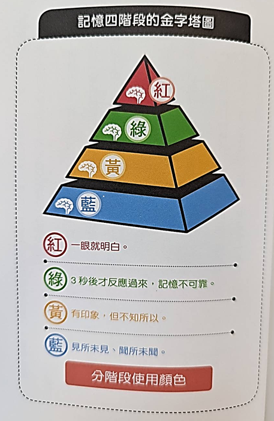
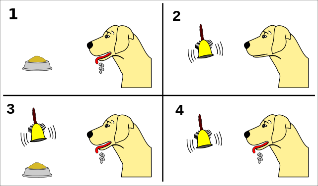

# 目視才容易記住 (O)
# 寫下來容易記住 (X)

### 「眼見為憑記憶法」才是最有效率的記憶方式

我高中寫了 3 年，英文還是爛的跟什麼一樣，家裡都還留著那些壯觀的紀錄，看著都覺得自己很認真耶哈哈


如果你不相信，「那你可曾訓練自己一秒一個單字的速度，只利用目視進行背記，而且持續三個月以上？」
這個問題，應該幾乎所有人都會回答「NO」



你可以試試看記住這三個英文，很神奇的，似乎真的有效

# 分段記憶比較好 (O)
# 依次牢記比較好 (X)

如果可以只用目視就記下所有東西是再好不過，但也是有例外
這個例外會發生在單字的「拼寫」、「中文書寫」上
這兩個都是「寫」的範疇，如果你還用「看」的就會適得其反

如果是要記住，或是文法相關的理解，就直接用看的記下來
如果是要拼寫，就要邊寫邊背才行
但現在考試幾乎都是選擇題，因此用看的效率會高很多

### 分類再背


背單字時如果想要將用法和拼寫一次全部背下來可能會適得其反
背英文單字最有效的方式是「一次只記住一個單字的意義」

因此如果一個單字有很多意思，一定要一次只記一個意思，之後再逐次背第二個、第三個

### 細分記憶內容，是提升記憶效率的訣竅。因為「有能力分類已經等於理解」


以「數學不好」的人為例，你是為了二次方程式傷腦筋，還是圖形問題？是看不懂應用題？還是計算容易出錯？
正因為「連自己也不知道哪裡讀不通」，所以才會討厭這些學科

反過來說，如果可以找出棘手的部分窮追到底，就能克服該科的恐懼

以背單字為例，首先
1. 先知道單字的意義；還不會拼寫
2. 邊寫邊記住

大部分的人都太貪心，想要一口吞掉所有食物，所以才會被噎住

# 邊走邊出聲背誦 (O)
# 端坐書桌前用功 (X)

* 邊寫邊背  -- 觸覺 + 視覺
* 邊讀邊背  -- 味覺 + 視覺 + 聽覺
* 邊讀邊走邊背 -- 味覺 + 視覺 + 聽覺 + 觸覺


至於嗅覺，可以使用香氛精油
雖然花錢又只能在室內使用，但這樣就連嗅覺也可以派上用場

而且這種精油還具備提升專注力、強化記憶的作用 (薄荷、迷迭香、檸檬草、葡萄柚)


刺激嗅覺還有更講究的用法，就是分科使用不同的香氣
把這些味道帶到考場，應該會有喚醒記憶的作用


# 雜音環境幫助記憶 (O)
# 安靜的環就好用功 (X)

因為少許的雜音可以刺激大腦設法排除干擾，迫使大腦提高專注力

### 不要一邊聽音樂一邊背書
這是背書很大的禁忌 (難怪我都讀不好哈哈哈)
特別是聽自己喜歡的歌手，注意力會不自覺被吸引，聽國外的歌曲會好一點，至少是不熟悉的語言比較不會被干擾

但我有發現我連輕音樂我都可以背下來，聽幾次之後輕音樂也不能放了

同理，也不能邊看電視邊背、聽廣播也不行



有些人會使用「流水聲」之類的音樂幫助記憶，但其實並不建議，因為這樣做，有可能會讓大腦養成「沒有流水聲就背不起來」

家中或是附近公園等稍微有點雜音的環境可以讓人自然進入集中精神的狀態

沒錯！大眾交通工具就符合這樣的環境條件，但這樣的公共場所，就沒這麼適合邊踱步邊唸出來，還請背書背到忘我的人留意

「反正車廂上的人都是跟我此生無緣的人，就算當我是怪胎，我也不在乎。對我來說，最重要的事情是考上好學校，其他事物都只是雜音而已」，在車上只要輕聲細語，自己聽的到就好了


### 成效卓越的大眾交通工具背書法
故意找「各站皆停、單程 90 分鐘」的車，會車往返
會選擇車頭或車尾最靠近連接處的位置，避免離車門很近，以免被進出人潮干擾分散注意力

但近年悠遊卡盛行，會有乘車紀錄，如果被務員發現，有個傢伙連坐了三個小時的車...也許就不妙了

# 人的專注力以 90 分鐘為限 (O)
# 專注力本來就是人各有高低 (X)

腦科學家告訴我們，人類的專注力最多只能撐 90 分鐘
找 90 分鐘的車也是因為如此

對自己定力沒信心的可以從 45 分鐘作為一開段落開始養成習慣

### 專注力以每 15 分鐘為一個波段
之前很紅的番茄鐘也是如此，每過 15 分鐘就會開始有點厭倦


這點我有點好奇真偽，如果是很討厭的內容，好像確實是如此
但我只要進入狀況，一次 90 分鐘好像完全不是問題

# 解決問題後再稍作休息 (O)
# 遇到不會的問題先暫停 (X)

「這個問題太難了，根本看不懂，先看漫畫再說」
「這個問題怎麼解都解不開，還是先看電視轉換心情吧」

你也是這樣解決問題的嗎？ 但其實這樣就是在逃避現實

### 解決問題後立刻去放鬆一下
簡而言之，大腦是「重感情」的。

如果遇到不會就放鬆，只會讓大腦覺得 「讀不懂 = 快樂」
相反的，解決問題就立刻放鬆，大腦就會覺得 「讀懂了 = 快樂」

就算解決的問題很簡單也一樣，只要解決就放鬆，就可以讓大腦認為「自己很靈光的狀態 = 快樂」

```text
但關於這點，我自己有額外的深刻體悟，作者說的應該是對的
但對於數學，或是程式這種邏輯問題，太過於專注很容易卡死在固定邏輯
鑽進去之後，就不容易出來，必須先暫離環境，讓自己幾乎忘記原本的想法
過一段時間再來看一次，也許就有機會用不一樣的觀點詮釋
這也是為什麼有時候自己寫的算式，過了一兩個月回來看居然看不懂了
```


# 背書要複習三次才能記住 (O)
# 背書要過目不忘一次就OK (X)

有太多人幻想要一次解決所有事情。
大腦並不會將真正對的事情都重要的事情，而是把一再重複的事情都做對的事情

看電視宣傳健康食品，心想：「吵死了，又來騙人！」
但同樣的廣告一再撥放，你或許就會動搖了：「廣告打這麼兇，如果是騙人的，應該不敢這麼明目張膽，所以應該是有效的才對」

### 一記強而有力的直拳比不上連發的刺拳攻擊
「不是打倒對方，而是不斷打到對方，你就會贏」 -- 世界拳王默罕默德·阿里


### 相信自己是天才，就會成為真正的天才

