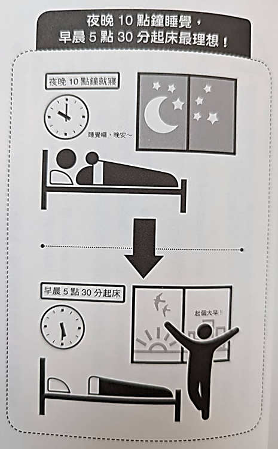
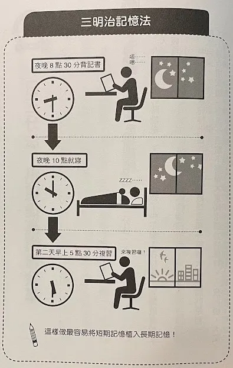
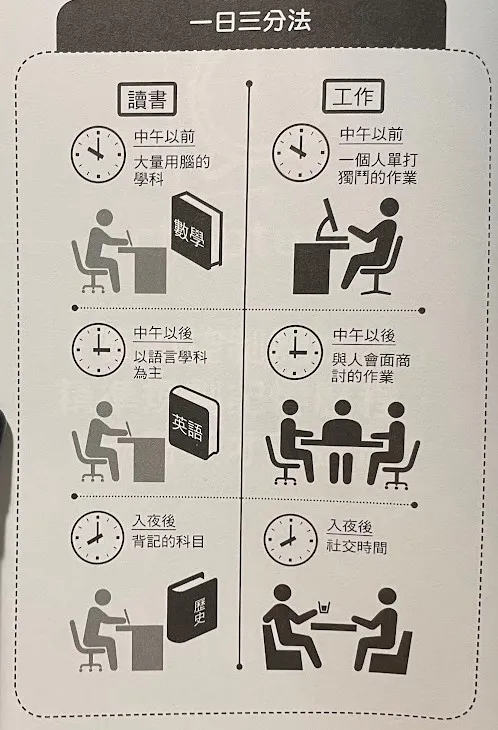

# 「三明治記憶法」夜晚睡前、晨間起床是最佳複習時間

將短期記憶植入長期記憶的過程必不可少的，就是「睡眠」

人在睡眠當中，潛意識處於毫無防備的狀態，腦袋裡的事情會在無意識中重新來過，植入長期記憶中

但這跟睡眠學習法是完全不一樣的事情，他完全不同於睡覺戴著耳機聽教學這種事

只要好好睡覺就行，睡覺時，腦神經「突觸」就會互相連接

你是否有曾經苦讀了整晚，結果卻立刻忘得一乾二淨？之所以望這麼快，是因為「熬夜了一整晚」沒有睡覺的緣故

# 最符合記憶需求的睡眠時數是「7 小時又 30 分鐘」
那麼，最適合睡幾個小時呢？
作者曾經試過睡三小時、四小時、五小時、六小時... 就為了找出「晚上睡多久可以在第二天精神飽滿又不會忘記前一天背過的功課」

前一天睡太少，第二天整天不是整天昏睡，就是有氣無力；相反的，睡超過八小時，起床腦袋昏沉，反應遲鈍，因此作者的結論是：
* 睡眠時間 七個小時又三十分鐘是最理想的（其次是 七小時）

有研究顯示，睡眠時數七小時左右的人，死亡率低於其他睡眠時數的；而罹患糖尿病和高血壓風險的人，也是睡眠七小時錢後的人最低

生長賀爾蒙 = 生長激素
生物分泌時間有兩個分泌高峰段：
1. 清晨 5 - 7 點
2. 晚上 11 - 1 點

所以最理想的就是 10 點躺好，10 點半入睡，11 點剛好進入熟睡期 (生長激素分泌旺盛)

參考資料：
[「一瞑大一吋」是真的 但睡錯時間恐致長不高](https://taipei.tzuchi.com.tw/%E3%80%8C%E4%B8%80%E7%9E%91%E5%A4%A7%E4%B8%80%E5%90%8B%E3%80%8D%E6%98%AF%E7%9C%9F%E7%9A%84-%E4%BD%86%E7%9D%A1%E9%8C%AF%E6%99%82%E9%96%93%E6%81%90%E8%87%B4%E9%95%B7%E4%B8%8D%E9%AB%98/)

# 香蕉與巧克力的神奇助力
血清素 (serotonin)：是快感的情緒傳導物質，能令人萌生自信開朗、輕鬆自在的幸福感，也有使人專注的作用。大腦缺乏血清素，有可能引發憂鬱現象。

「血清素」這種大腦神經傳導物質，據說有助於將短期記憶植入長期記憶中

在每天早上起床，血清素會分泌旺盛，此時來一根香蕉，是清晨用功讀書的絕配

因為香蕉富含「色胺酸」和維生素 B6，前者是製造血清素的前驅物質，後者有助於協助合成血清素

色胺酸在研究上，發現主要能幫助維持正向想法及好入睡的平衡穩定：
1. 幫助入睡
2. 放鬆緊張
3. 幫助正向、快樂積極
4. 舒緩女性特殊時期心情波動
5. 調節操勞感

參考資料：[色胺酸是什麼？營養師說明色胺酸功效、食物、怎麼吃！](https://www.daikenshop.com/article/tryptophan)

有一陣子日本流行早上吃香蕉減肥，台灣好像也流行過，事實上早上吃香蕉有助於將短期記憶植入長期記憶

### 早上吃香蕉，讀書吃巧克力

巧克力中含有可可鹼，有提高記憶力和專注力的作用
雖然作者覺得糖分可以消除大腦疲勞，但我還是覺得可以選 70% 以上的巧克力，對身體的負擔可能會小一點

# 將短期記憶轉換成長期記憶的方式

睡前複習，這聽起來有點籠統，精確地講，應該是「就寢前的 90 分鐘」

早上一起床，是血清素分泌最旺盛的時候，所以選在一起床後的 90 分鐘，複習前一晚背的內容，可以收到事半功倍的效果

# 睡前 90 分鐘和起床後 90 分鐘背書效果最好

這樣就叫做「三明治記憶法」，期間夾著 7 個多小時的睡眠時間，最容易將短期記憶植入長期記憶中

必須注意的事情，不要在早晨背新的東西，早上的時間純粹用來複習，複習前一天或是更之前的內容

# 一日三分法，迅速提高讀書效率

大腦最活躍的時間是早晨，接著中午到入夜，大腦會越來越疲倦

中午以前，腦筋會特別靈活，很適合用來「數學」這種需要用腦、理解的科目

下午適合讀「語言」這種不需要大量耗腦的科目

晚上大腦已經疲倦，最適合讀「歷史」這種適合背的科目

### 職場人士一樣可以用一日三分法
早上就用來做一個人單打獨鬥的事情

中午過後腦力稍微變得時緩，可以選擇與人討論、合作的作業

晚上就屬於跟大家的社交時間

