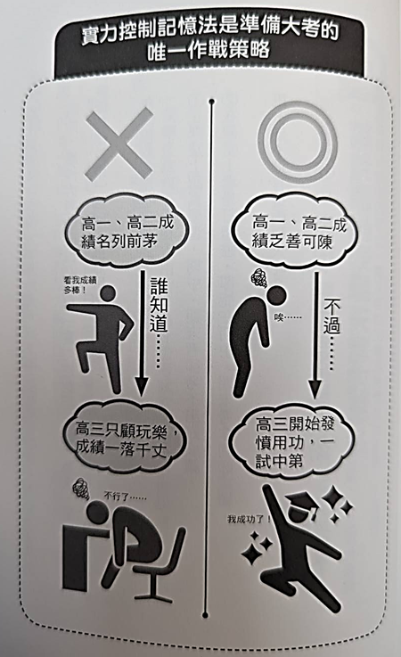
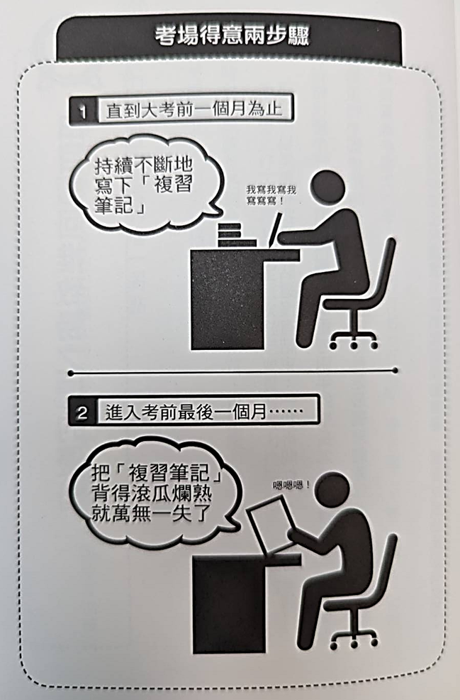
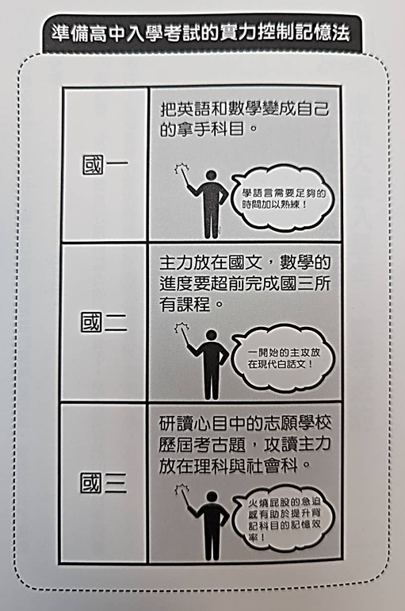
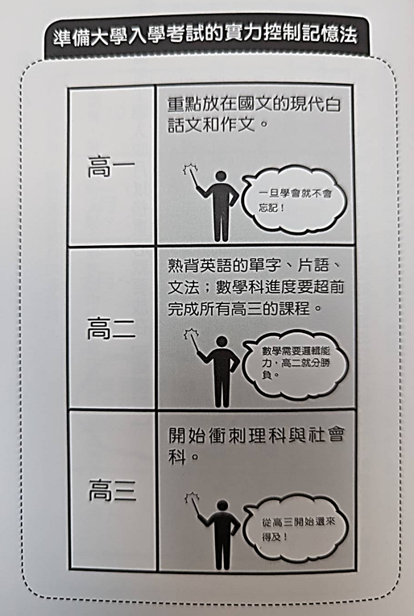
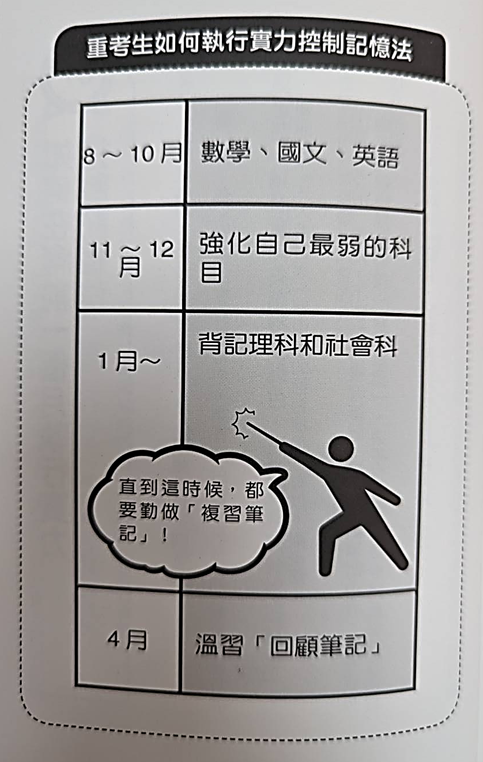

# 實力控制記憶法
精準規劃記憶歷程，一日天才可速成

「模擬考再怎麼說也只是模擬考而已，凡是跟正式考試無關的，都不用理會。」
「準備大考說穿了沒有別的，就是不厭其煩的寫下複習筆記，然後只要一直複習 複習筆記 裡面的內容，大考就沒問題了」

想要在大考上大展身手，以下兩個步驟缺一不可：
1. 直到考前一個月為止，持續不斷的寫下「複習筆記」
2. 進入考前最後一個月，想辦法把複習筆記背到滾瓜爛熟

### 想要在正式考場上發揮實力控制記憶法的效用，就要以成功上榜為目標，倒回去推算該如何用功，並且以此擬定作戰時程表，勝敗就看這一回了

但這個「實力控制記憶法」有個大缺點，他無法獲得周遭人的理解

雖然一開始就先說服爸媽，希望獲得他們的諒解，但他們仍然擔心的不得了，他們真的以為：「高中三年級的時候還是全國模擬考榜首，當了重考生卻忽然瘋了...... 我們家兒子不行了，這該怎麼辦才好？」

這一段真的超好笑🤣🤣

# 準備高中入學考的實力控制記憶法
以準備高中入學考為例，
國一就要全力攻讀英文、數學兩科，想要學好語言，任何人都需要時間，必須花苦工反覆一聽在聽直到滾瓜爛熟

而數學需要足夠好的邏輯，只要邏輯好，數學就不容易忘，國一學會的，國三入學考也不會忘

因此國一就要將英文和數學變成自己的拿手科目
國二開始主攻國文
國文中又以現代白話文為主要努力重點
另外國二還有一項任務，就是數學進度要超前，完成國三所有數學課程，這樣國三上數學就像是總複習一樣輕鬆

一升上國三就要研讀以往的歷屆試題，並且開始猛攻數理和社會科學這些需要大量背記的科目「已經沒時間了！」這種迫在眉睫的感覺會迫使我們衝刺

像這樣先處理邏輯科目，在把需要背的東西留到最後，這就是實例控制記憶法的必勝要領

# 準備大學考
高一主攻 國文、作文
高二主攻 英文、數學
* 英文單字
* 英文片語
* 英文文法

高三主攻 理科、社會科

高二的時候就要提前把高三的數學學完

# 結語
1. 隨時意識到記憶有不同種類！時間記憶法
2. 刺激右腦！四色記憶法
3. 將短期記憶植入長期記憶！三明治記憶法
4. 成為考試當天一日天才！實力控制記憶法

記住！記憶有四種類型
1. 短期記憶
2. 長期記憶
3. 單純記憶
4. 影像記憶

為了提升效率，使用紅、綠、黃、藍四種顏色加以區別，為了進一步將短期記憶植入大腦，利用三明治記憶法，發揮一日的最佳效率

最後善用實力控制記憶法，確保大考金榜題名

記住這個順序：
1. 瞭解大腦記憶運作機制
2. 瞭解如何使用右腦提升記憶效率
3. 瞭解如何發揮一日最佳記憶效率
4. 瞭解大考當天如何順利過關的記憶法

作者：日本人，石井貴士