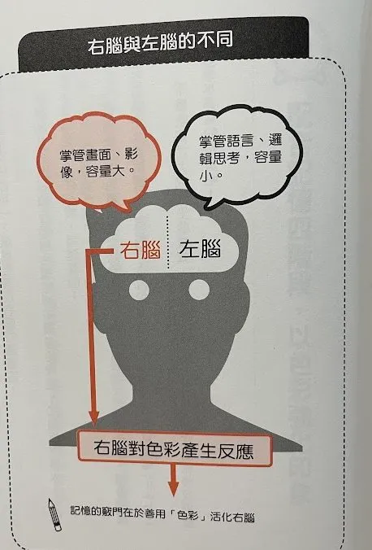
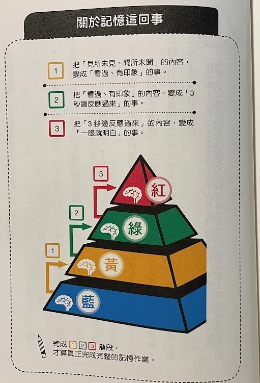

# 「四色記憶法」善用色彩工具，開發右腦記憶空間

* 左腦：掌管語言、邏輯，容量小
* 右腦：掌管畫面、影像，容量大

在書寫的時候，使用「藍色墨水」是強化記憶的正確答案
如果想要斷絕連結，就常常使用黑色

像是網頁超連結的顏色也是藍色

1. 必須和記憶連結的內容，用藍色書寫
2. 無關緊要的內容，用黑色書寫

* 養成使用藍色墨水書寫的好習慣，是右腦記憶法的第一步，隨身常備藍色筆就對了，光是這麼做，記憶力就可以增強 1.1 倍

# 配合記憶四階段，以色彩強化印象
使用顏色加強讀書效率，但僅以「四色」為限，當顏色過多時，反而會思考接下來要用什麼顏色

而這四種顏色分別是，紅色、綠色、黃色、藍色

記憶四階段：
1. 一眼就明白
2. 三秒後才反應過來，記憶不可靠
3. 有印象，但不知所以
4. 前所未聞，完全不知道的

書上面是按 紅色、綠色、黃色、藍色 順序，但我覺得紅色感覺就會有一種最重要的感覺，所以應該照個人喜好沒關係

而記憶順序，就要從最不會的開始記 4 -> 3 -> 2 -> 1

書讀不好，往往都是因為讀書的觀念不對。
不對的原因在於，以為只要把「不會的東西讀會」就好了
但這樣只不過是讓第四階段變成第三階段
讀會了還要繼續依再複習，直到可以直覺反應，一直到第一階段，這樣才是百分百的記住

# 四色魔法記憶紙
除了四種顏色的螢光筆，還有四種顏色的便利貼，便利貼還要有大、中、小，三種尺寸

以背單字為例，可以先將單字寫在小便利貼上，然後再貼到 「四色魔法記憶紙」上

他提供了下載處
https://www.1study.jp/colormagic/color_magic_sheet.pdf

1. 完全沒看過的貼在 藍色
2. 有印象但不太懂得貼 黃色
3. 三秒後才反應過來的貼 綠色
4. 一眼就明白的貼 紅色

然後也可以用顏色分類，以英文來說：
* 紅色：名詞
* 綠色：動詞、片語
* 黃色：形容詞、其他
* 藍色：副詞、連接詞、文法

背世界史的話可以這樣區分：
* 紅色：人名
* 綠色：事件
* 黃色：其他
* 藍色：年號

# 使用四色檔案夾

把四色紙，或是活頁紙投進四色資料夾中：
* 紅色資料夾：一眼就明白的內容
* 綠色資料夾：三秒後才反應過來
* 黃色資料夾：有印象，但不多
* 藍色資料夾：完全不會的內容

當紅色資料夾東西越來越多，代表牢記的內容越來越多
平時把綠色的資料夾帶在身邊，方便複習；綠色 = 「三秒後才反應過來」

* 如果資料夾都裝滿了，那就是必要進行整理，可以換成四色檔案盒

當眼中只剩下四種顏色時，你的大腦就會有條件反射了

* 著名的實驗：帕布洛夫實驗：古典制約

圖片來源：https://pansci.asia/archives/41780

